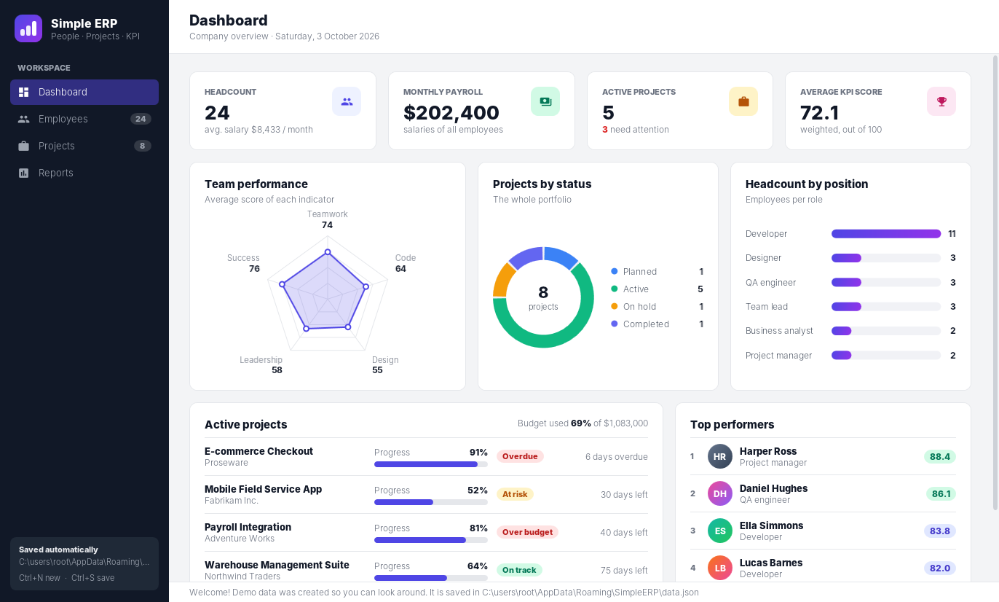
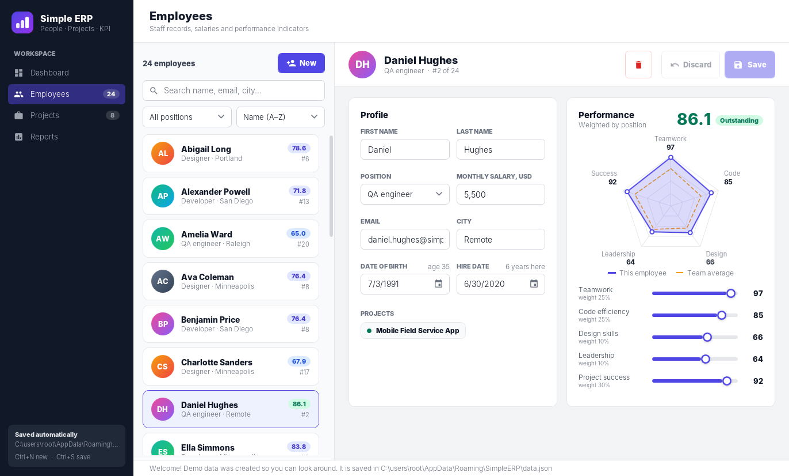
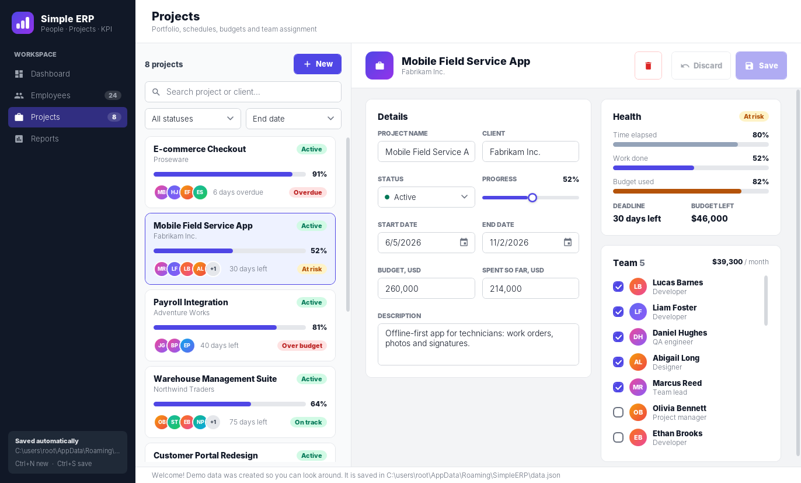
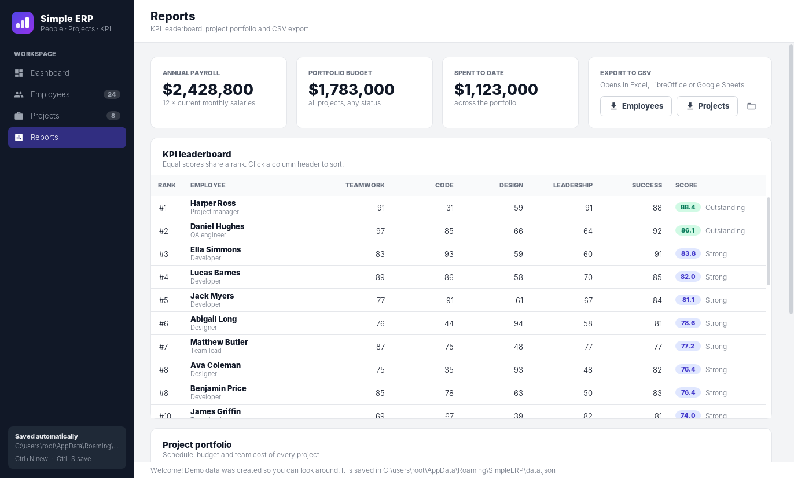
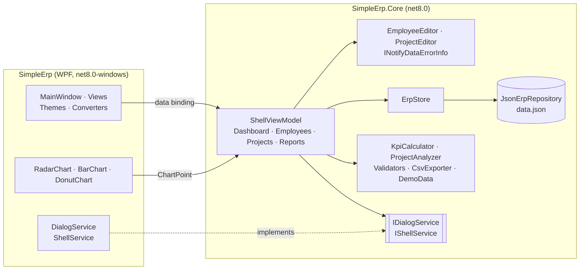

<div align="center">


# Simple ERP

**A small desktop ERP for a software team: employees, projects, KPI scoring and reports.**

[](https://github.com/Staery/Simple_ERP/actions/workflows/ci.yml)


[](LICENSE)

**English** · [Русский](README.ru.md)

</div>

---

Simple ERP is a Windows desktop app for the people side of a small IT company. It keeps the staff list with salaries
and five performance indicators, tracks projects with their schedule, budget and team, turns the indicators into a
KPI leaderboard and shows everything on a dashboard.

I wrote the first version in 2018 on .NET Framework with MahApps.Metro and LiveCharts. In 2026 I rebuilt it on
.NET 8 to practise a clean MVVM architecture: a UI-independent core with unit tests, a hand-made WPF theme and
charts drawn without third-party libraries. The original idea and data model (employees, KPI indicators, ranking,
projects) are kept; the bugs of the first version are fixed and listed [below](#-what-changed-compared-to-the-2018-version).

## 📸 Screenshots



| Employee profile and KPI | Project editor and team |
|---|---|
|  |  |



<sub>The screenshots show the demo data that is created on the first start.</sub>

## ✨ Features

| | |
|---|---|
| 📊 **Dashboard** | Headcount, payroll, active projects and average KPI, a team radar chart, projects by status, headcount by position, active projects that need attention and the top performers |
| 👥 **Employees** | Search, filter by position and sort by name, KPI score, salary or hire date. The editor shows age and tenure, the employee's projects and a live radar chart compared with the team average |
| 🎯 **KPI scoring** | Five indicators (teamwork, code efficiency, design skills, leadership, project success) are combined into one score **weighted by position** and graded from *Needs attention* to *Outstanding* |
| 🏆 **Leaderboard** | Standard competition ranking: equal scores share a rank (1, 2, 2, 4) |
| 📁 **Projects** | Client, status, dates, budget, spending and progress. Assign a team with check boxes and see its monthly cost |
| 🚦 **Project health** | *On track*, *At risk* (progress behind the schedule or spending ahead of progress), *Over budget*, *Overdue*, *Not started*, *On hold*, *Completed* |
| ✅ **Validation** | Messages appear under the fields as you type: required names, e-mail format, age 16–80, hire date not in the future, positive salary, end date after start date, and more |
| 🛡 **No lost work** | Switching to another record, page or closing the window with unsaved changes asks to save, discard or cancel |
| 📤 **CSV export** | Employees (with rank and score) and projects (with health and team) as UTF-8 CSV that opens in Excel |
| 💾 **Safe storage** | One human-readable JSON file, written atomically. A damaged file is moved aside instead of being overwritten |
| ⌨️ **Shortcuts** | `Ctrl+N` new record, `Ctrl+S` save |

### How the KPI score is weighted

| Position | Teamwork | Code efficiency | Design skills | Leadership | Project success |
|---|---:|---:|---:|---:|---:|
| Developer | 20% | **35%** | 10% | 10% | 25% |
| Designer | 20% | 10% | **35%** | 10% | 25% |
| QA engineer | 25% | 25% | 10% | 10% | **30%** |
| Business analyst | 25% | 5% | 15% | 20% | **35%** |
| Team lead | 20% | 20% | 5% | **30%** | 25% |
| Project manager | 25% | 0% | 5% | **35%** | **35%** |

## 🧱 Tech stack

| Area | Technology |
|---|---|
| Runtime | .NET 8, C# 12 (nullable reference types, file-scoped namespaces, primary constructors, collection expressions) |
| UI | WPF with custom resource dictionaries (colors, control templates, vector icons), no UI toolkit |
| Charts | Own `RadarChart`, `BarChart` and `DonutChart` controls drawn in `OnRender` |
| Architecture | MVVM with [CommunityToolkit.Mvvm](https://learn.microsoft.com/dotnet/communitytoolkit/mvvm/) source generators, `INotifyDataErrorInfo` validation, `Microsoft.Extensions.DependencyInjection` |
| Storage | `System.Text.Json` |
| Tests | xUnit, 155 tests: domain logic, storage, CSV and view-model scenarios with fakes |
| CI/CD | GitHub Actions: build, test and a self-contained single-file `.exe` on every push; tagged versions become GitHub releases |

## 🏗 Architecture

All logic, including the view models, lives in `SimpleErp.Core`, a plain `net8.0` library that knows nothing about
WPF. It is fully unit-tested and builds on Linux and macOS. The WPF project contains only XAML, chart controls,
converters and thin platform services.



Key design decisions:

- **One store, write-through.** `ErpStore` holds the only in-memory copy. Every change is applied to a copy of the
  data, written to disk and only then made live, so a failed write leaves both the file and the UI consistent.
- **Editors work on a copy.** Editing never touches the stored record until *Save*, which makes *Discard* and the
  unsaved-changes prompt straightforward.
- **Validation errors appear when they are useful.** A field shows its error once it has been edited, or after a
  save attempt, so a new, empty form does not start out red.
- **Pure domain functions.** KPI weighting, ranking and project health are static functions of their input and the
  current date, so they are trivial to test.
- **Why a JSON file and not a database?** The data set is small (dozens to hundreds of records) and always read and
  written as a whole. A single JSON file is human-readable, easy to back up, needs no native SQLite library in the
  single-file build and lets the tests run anywhere. Storage sits behind `IErpRepository`, so moving to EF Core and
  SQLite would only add a new implementation.
- **Why own charts?** The three charts need a few hundred lines of drawing code. That avoids a charting package
  (and SkiaSharp's native binaries) and renders identically on every machine.

### Project layout

```
Simple_ERP/
├── src/
│   ├── SimpleErp/                  # WPF application
│   │   ├── Themes/                 # Colors.xaml, Controls.xaml, Icons.xaml: the design system
│   │   ├── Views/                  # Dashboard, Employees, Projects, Reports
│   │   ├── Charts/                 # RadarChart, BarChart, DonutChart
│   │   ├── Converters/
│   │   └── Services/               # DialogService, ShellService
│   └── SimpleErp.Core/             # UI-independent logic
│       ├── Models/                 # Employee, Project, KpiScores, ErpData
│       ├── Services/               # ErpStore, repository, KPI, project health, CSV, demo data
│       ├── Validation/             # EmployeeValidator, ProjectValidator
│       ├── ViewModels/             # shell, pages and editors
│       └── Abstractions/           # IDialogService, IShellService
├── tests/
│   └── SimpleErp.Core.Tests/       # xUnit tests
└── .github/workflows/ci.yml
```

## 🛠 What changed compared to the 2018 version

The first version was a single .NET Framework 4.6.1 project. Rebuilding it fixed these problems:

- **Editing an employee created a duplicate.** `ControllerBase.Save` updated the existing record and then added it to
  the list again anyway. The store now replaces records by id.
- **The ranking went stale.** Ranks were calculated once at start-up from a truncated integer average, were not
  copied by `Clone()` and were never recalculated after an edit. Scores and ranks are now calculated from the current
  data every time, with ties handled explicitly.
- **The app depended on the internet.** Employees were downloaded from randomuser.me with a blocking request inside
  the view-model constructor, so the window froze on start-up and the app crashed offline; avatars were loaded from a
  third-party URL. Demo data is now generated locally and avatars are drawn from initials.
- **Nothing was saved.** All changes were lost on exit. Data is now stored in `%APPDATA%\SimpleERP\data.json`.
- **Editing text could corrupt it.** Text boxes were bound through a converter that prefixed values with `Label: ` and
  removed *all* spaces when reading them back, so "New York" became "NewYork". Typing a non-number into the salary
  silently kept the old value. Fields are now plain inputs with validation messages.
- **New employees had no id.** A reflection helper filled every empty field with `"None"`, so all new employees
  shared the id `"None"` and saving a second one overwrote the first.
- **Age and birth date could disagree**, because both were stored. Age is now derived from the birth date.
- **The KPI chart relied on reflection over compiler-generated backing fields**, whose order is not guaranteed. The
  indicators are now an explicit enum.
- **Crashes:** the first-letter converter threw on an empty string, and an empty employee list caused an index of -1.
- **Projects were placeholders:** dates were `01.01.0001`, progress was random and employees could not be assigned.
  Projects now have real dates, budget, spending, a team and a health status.
- Commands were dispatched through a dictionary of magic strings; position names had typos (`emloyee`); an unused,
  empty window (`sdfsdfsd.xaml`) was removed.

## 🚀 Getting started

### Download

Download `SimpleERP-*-win-x64*.zip` from [Releases](https://github.com/Staery/Simple_ERP/releases) and run
`SimpleERP.exe`. The framework-dependent build needs the
[.NET 8 Desktop Runtime](https://dotnet.microsoft.com/download/dotnet/8.0); the self-contained one from the
[CI artifacts](https://github.com/Staery/Simple_ERP/actions) does not.

### Build from source

Requirements: Windows 10/11 and the [.NET 8 SDK](https://dotnet.microsoft.com/download/dotnet/8.0) (or Visual Studio
2022 with the *.NET desktop development* workload).

```bash
git clone https://github.com/Staery/Simple_ERP.git
cd Simple_ERP
dotnet run --project src/SimpleErp
```

Run the tests on any OS:

```bash
dotnet test tests/SimpleErp.Core.Tests
```

Build a single-file executable:

```bash
dotnet publish src/SimpleErp -c Release -r win-x64 --self-contained -p:PublishSingleFile=true -o publish
```

### Where is my data?

In `%APPDATA%\SimpleERP\data.json`. Delete the file to start again with fresh demo data.

```json
{
  "schemaVersion": 1,
  "employees": [
    {
      "id": "5e4d0000-0000-4000-8000-000000000000",
      "firstName": "Olivia",
      "lastName": "Bennett",
      "email": "olivia.bennett@simple-erp.example",
      "city": "Remote",
      "position": "projectManager",
      "birthDate": "1974-10-27",
      "hireDate": "2024-06-17",
      "monthlySalary": 9600,
      "kpi": { "teamwork": 66, "codeEfficiency": 24, "designSkills": 43, "leadership": 72, "projectSuccess": 61 }
    }
  ],
  "projects": [ … ]
}
```

## 🧪 Tests

`tests/SimpleErp.Core.Tests` (155 tests) covers:

- **KPI:** weights add up to 100 for every position, weighting, clamping, grades and competition ranking
- **Project health:** every status, schedule and budget edge cases, team cost
- **Validation:** all employee and project rules
- **Storage:** JSON round trip, readable format, corrupt files moved aside, hand-edited files normalised
- **Store:** no duplicates on save, removal from teams when an employee is deleted, rollback when writing fails
- **CSV:** escaping (including spreadsheet formula injection), invariant number formats, UTF-8 with BOM
- **View models:** filtering and sorting, create/save/delete, the unsaved-changes prompt (save, discard, cancel),
  navigation guard, keyboard shortcuts, export

## 🗺 Roadmap

- [ ] Time tracking per project and employee
- [ ] KPI history with a trend chart
- [ ] Import employees from CSV
- [ ] Dark theme

## 📄 License

[MIT](LICENSE) © 2018–2026 Anton Selkin
