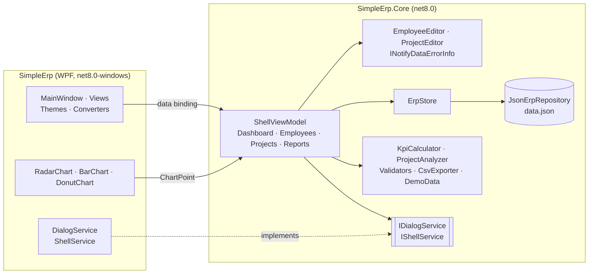

<div align="center">


# Simple ERP

**Небольшая настольная ERP для команды разработки: сотрудники, проекты, оценка KPI и отчёты.**

[](https://github.com/Staery/Simple_ERP/actions/workflows/ci.yml)


[](LICENSE)

[English](README.md) · **Русский**

</div>

---

Simple ERP — настольное приложение для Windows, которое закрывает «кадровую» часть небольшой IT-компании. В нём
ведётся список сотрудников с зарплатами и пятью показателями эффективности, учитываются проекты со сроками, бюджетом
и командой, показатели сводятся в рейтинг KPI, а всё вместе выводится на дашборд.

Первую версию я написал в 2018 году на .NET Framework с MahApps.Metro и LiveCharts. В 2026 году я пересобрал её на
.NET 8, чтобы отработать чистую архитектуру MVVM: независимое от UI ядро с unit-тестами, собственная тема WPF и
графики без сторонних библиотек. Исходная идея и модель данных (сотрудники, показатели KPI, рейтинг, проекты)
сохранены, а ошибки первой версии исправлены — их список [ниже](#-что-изменилось-по-сравнению-с-версией-2018-года).

## 📸 Скриншоты


| Профиль сотрудника и KPI | Редактор проекта и команда |
|---|---|
|  |  |


<sub>На скриншотах — демонстрационные данные, которые создаются при первом запуске.</sub>

## ✨ Возможности

| | |
|---|---|
| 📊 **Дашборд** | Численность, фонд оплаты труда, активные проекты и средний KPI, «паутинка» по команде, проекты по статусам, численность по должностям, проекты, требующие внимания, и лучшие сотрудники |
| 👥 **Сотрудники** | Поиск, фильтр по должности, сортировка по имени, KPI, зарплате или дате найма. В редакторе — возраст и стаж, проекты сотрудника и «паутинка» KPI в сравнении со средним по команде, обновляемая на лету |
| 🎯 **Оценка KPI** | Пять показателей (командная работа, эффективность кода, дизайн, лидерство, успешность проектов) сводятся в одну оценку **с весами по должности** и получают уровень — от *Needs attention* до *Outstanding* |
| 🏆 **Рейтинг** | Стандартное «спортивное» ранжирование: одинаковые оценки делят место (1, 2, 2, 4) |
| 📁 **Проекты** | Клиент, статус, сроки, бюджет, расходы и прогресс. Команда назначается галочками, сразу видна её стоимость в месяц |
| 🚦 **Состояние проекта** | *On track*, *At risk* (прогресс отстаёт от графика или расходы опережают прогресс), *Over budget*, *Overdue*, *Not started*, *On hold*, *Completed* |
| ✅ **Валидация** | Сообщения появляются под полями прямо при вводе: обязательные имена, формат e-mail, возраст 16–80, дата найма не в будущем, положительная зарплата, дата окончания не раньше даты начала и т. д. |
| 🛡 **Без потери данных** | При переходе к другой записи, на другую страницу или закрытии окна с несохранёнными изменениями приложение предлагает сохранить, отменить или остаться |
| 📤 **Экспорт в CSV** | Сотрудники (с местом и оценкой) и проекты (с состоянием и командой) в UTF-8 CSV, который открывается в Excel |
| 💾 **Надёжное хранение** | Один читаемый JSON-файл с атомарной записью. Повреждённый файл переносится в сторону, а не перезаписывается |
| ⌨️ **Горячие клавиши** | `Ctrl+N` — новая запись, `Ctrl+S` — сохранить |

### Веса показателей в оценке KPI

| Должность | Командная работа | Эффективность кода | Дизайн | Лидерство | Успешность проектов |
|---|---:|---:|---:|---:|---:|
| Developer | 20% | **35%** | 10% | 10% | 25% |
| Designer | 20% | 10% | **35%** | 10% | 25% |
| QA engineer | 25% | 25% | 10% | 10% | **30%** |
| Business analyst | 25% | 5% | 15% | 20% | **35%** |
| Team lead | 20% | 20% | 5% | **30%** | 25% |
| Project manager | 25% | 0% | 5% | **35%** | **35%** |

## 🧱 Технологии

| Область | Технология |
|---|---|
| Платформа | .NET 8, C# 12 (nullable reference types, file-scoped namespaces, primary constructors, collection expressions) |
| UI | WPF с собственными словарями ресурсов (цвета, шаблоны элементов, векторные иконки), без UI-библиотек |
| Графики | Собственные элементы `RadarChart`, `BarChart` и `DonutChart`, рисуются в `OnRender` |
| Архитектура | MVVM на [CommunityToolkit.Mvvm](https://learn.microsoft.com/dotnet/communitytoolkit/mvvm/) с генераторами кода, валидация через `INotifyDataErrorInfo`, `Microsoft.Extensions.DependencyInjection` |
| Хранение | `System.Text.Json` |
| Тесты | xUnit, 155 тестов: предметная логика, хранение, CSV и сценарии view-моделей с фейками |
| CI/CD | GitHub Actions: сборка, тесты и self-contained `.exe` одним файлом на каждый push; теги версий публикуются как релизы |

## 🏗 Архитектура

Вся логика, включая view-модели, находится в `SimpleErp.Core` — обычной библиотеке `net8.0`, которая ничего не знает
о WPF. Она полностью покрыта тестами и собирается на Linux и macOS. В WPF-проекте остались только XAML, элементы
графиков, конвертеры и тонкие платформенные сервисы.



Ключевые решения:

- **Одно хранилище со сквозной записью.** `ErpStore` держит единственную копию данных в памяти. Каждое изменение
  применяется к копии, записывается на диск и только после этого становится текущим, поэтому неудачная запись не
  рассинхронизирует файл и интерфейс.
- **Редакторы работают с копией.** Сохранённая запись не меняется до нажатия *Save*, поэтому *Discard* и вопрос о
  несохранённых изменениях реализуются просто.
- **Ошибки показываются тогда, когда они полезны.** Поле показывает ошибку после того, как его изменили, или после
  попытки сохранить — новая пустая форма не становится сразу красной.
- **Чистые функции предметной области.** Веса KPI, рейтинг и состояние проекта — статические функции от входных
  данных и текущей даты, их легко тестировать.
- **Почему JSON-файл, а не база данных?** Данных немного (десятки–сотни записей), и они всегда читаются и пишутся
  целиком. Один JSON-файл читается глазами, легко копируется, не требует нативной библиотеки SQLite в однофайловой
  сборке и позволяет запускать тесты где угодно. Хранилище скрыто за `IErpRepository`, так что переход на EF Core и
  SQLite — это просто ещё одна реализация.
- **Почему свои графики?** Трём графикам хватает нескольких сотен строк кода отрисовки. Это избавляет от
  графической библиотеки (и нативных файлов SkiaSharp) и выглядит одинаково на любой машине.

### Структура проекта

```
Simple_ERP/
├── src/
│   ├── SimpleErp/                  # WPF-приложение
│   │   ├── Themes/                 # Colors.xaml, Controls.xaml, Icons.xaml — дизайн-система
│   │   ├── Views/                  # Dashboard, Employees, Projects, Reports
│   │   ├── Charts/                 # RadarChart, BarChart, DonutChart
│   │   ├── Converters/
│   │   └── Services/               # DialogService, ShellService
│   └── SimpleErp.Core/             # логика без зависимости от UI
│       ├── Models/                 # Employee, Project, KpiScores, ErpData
│       ├── Services/               # ErpStore, репозиторий, KPI, состояние проектов, CSV, демо-данные
│       ├── Validation/             # EmployeeValidator, ProjectValidator
│       ├── ViewModels/             # оболочка, страницы и редакторы
│       └── Abstractions/           # IDialogService, IShellService
├── tests/
│   └── SimpleErp.Core.Tests/       # тесты xUnit
└── .github/workflows/ci.yml
```

## 🛠 Что изменилось по сравнению с версией 2018 года

Первая версия была одним проектом на .NET Framework 4.6.1. При переработке исправлено следующее:

- **Редактирование сотрудника создавало дубликат.** `ControllerBase.Save` обновлял существующую запись, а затем всё
  равно добавлял её в список ещё раз. Теперь хранилище заменяет записи по id.
- **Рейтинг устаревал.** Места считались один раз при запуске по усечённому целочисленному среднему, не копировались
  в `Clone()` и не пересчитывались после редактирования. Теперь оценки и места каждый раз считаются по актуальным
  данным, одинаковые оценки обрабатываются явно.
- **Приложение зависело от интернета.** Сотрудники загружались с randomuser.me блокирующим запросом прямо в
  конструкторе view-модели: окно зависало при запуске, а без сети приложение падало; аватары грузились со
  стороннего сайта. Теперь демо-данные создаются локально, а аватары рисуются из инициалов.
- **Ничего не сохранялось.** Все изменения терялись при выходе. Теперь данные хранятся в `%APPDATA%\SimpleERP\data.json`.
- **Редактирование портило текст.** Поля были привязаны через конвертер, который добавлял к значению префикс
  `Label: `, а при обратном преобразовании удалял *все* пробелы — «New York» превращался в «NewYork». Ввод не числа в
  зарплату молча оставлял старое значение. Теперь это обычные поля с сообщениями валидации.
- **У новых сотрудников не было id.** Вспомогательный метод на рефлексии заполнял все пустые поля строкой `"None"`,
  поэтому все новые сотрудники получали id `"None"`, и сохранение второго перезаписывало первого.
- **Возраст и дата рождения могли не совпадать**, потому что хранились оба. Теперь возраст вычисляется из даты рождения.
- **График KPI опирался на рефлексию по сгенерированным компилятором полям**, порядок которых не гарантирован.
  Теперь показатели — явное перечисление.
- **Падения:** конвертер первой буквы падал на пустой строке, а пустой список сотрудников приводил к индексу -1.
- **Проекты были заглушками:** даты `01.01.0001`, случайный прогресс, назначить сотрудников было нельзя. Теперь у
  проектов есть настоящие сроки, бюджет, расходы, команда и состояние.
- Команды вызывались через словарь «магических строк»; в названиях должностей были опечатки (`emloyee`); удалено
  пустое неиспользуемое окно (`sdfsdfsd.xaml`).

## 🚀 Запуск

### Скачать

Скачайте `SimpleERP-*-win-x64*.zip` со страницы [Releases](https://github.com/Staery/Simple_ERP/releases) и запустите
`SimpleERP.exe`. Для framework-dependent сборки нужен
[.NET 8 Desktop Runtime](https://dotnet.microsoft.com/download/dotnet/8.0); self-contained сборке из
[артефактов CI](https://github.com/Staery/Simple_ERP/actions) он не нужен.

### Сборка из исходников

Требования: Windows 10/11 и [.NET 8 SDK](https://dotnet.microsoft.com/download/dotnet/8.0) (или Visual Studio 2022
с нагрузкой *.NET desktop development*).

```bash
git clone https://github.com/Staery/Simple_ERP.git
cd Simple_ERP
dotnet run --project src/SimpleErp
```

Тесты запускаются на любой ОС:

```bash
dotnet test tests/SimpleErp.Core.Tests
```

Сборка в один исполняемый файл:

```bash
dotnet publish src/SimpleErp -c Release -r win-x64 --self-contained -p:PublishSingleFile=true -o publish
```

### Где хранятся данные?

В `%APPDATA%\SimpleERP\data.json`. Удалите файл, чтобы начать заново со свежими демо-данными. Формат файла показан
в [английской версии README](README.md#where-is-my-data).

## 🧪 Тесты

`tests/SimpleErp.Core.Tests` (155 тестов) проверяют:

- **KPI:** веса каждой должности дают в сумме 100, взвешивание, ограничение диапазона, уровни и ранжирование
- **Состояние проектов:** все статусы, граничные случаи сроков и бюджета, стоимость команды
- **Валидацию:** все правила для сотрудников и проектов
- **Хранение:** сохранение и чтение JSON, читаемый формат, перенос повреждённых файлов, нормализация файлов,
  отредактированных вручную
- **Хранилище:** отсутствие дубликатов при сохранении, удаление из команд при удалении сотрудника, откат при ошибке
  записи
- **CSV:** экранирование (включая защиту от формул в таблицах), инвариантный формат чисел, UTF-8 с BOM
- **View-модели:** фильтры и сортировка, создание/сохранение/удаление, вопрос о несохранённых изменениях
  (сохранить, отменить, остаться), защита навигации, горячие клавиши, экспорт

## 🗺 Планы

- [ ] Учёт рабочего времени по проектам и сотрудникам
- [ ] История KPI с графиком динамики
- [ ] Импорт сотрудников из CSV
- [ ] Тёмная тема

## 📄 Лицензия

[MIT](LICENSE) © 2018–2026 Anton Selkin
